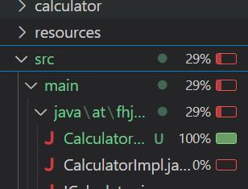

The  testAddNormalValues method validates that adding two positive numbers correctly returns their sum. In testAddWithZero , it ensures that adding two zeros results in zero, while testAddWithNegative verifies adding a negative number to a positive number produces the expected outcome.

For division, testDivideNormalValues confirms that dividing two positive numbers yields the correct quotient. The testDivideByZero method checks that dividing a number by zero produces DOUBLE.NEGATIVE_INFINITY according to the current implementation. Meanwhile, testDivideNegativeValues ensures that dividing two negative numbers results in a positive value.

The subtraction methods focus on various cases. testMinusNormalValues validates the subtraction of two positive numbers, while testMinusWithNegative examines the subtraction involving two negative values. Additionally, testMinusWithZero ensures that subtracting zero does not alter the original number.

Lastly, the multiplication methods cover typical scenarios. testMultiplyByNormalValues confirms the product of two positive numbers, and testMultiplyByNegativeNumbers ensures multiplying two negatives results in a positive. Finally, testMultiplyWithZero ensures multiplying any number by zero produces zero.

Failed Execution of factorial method